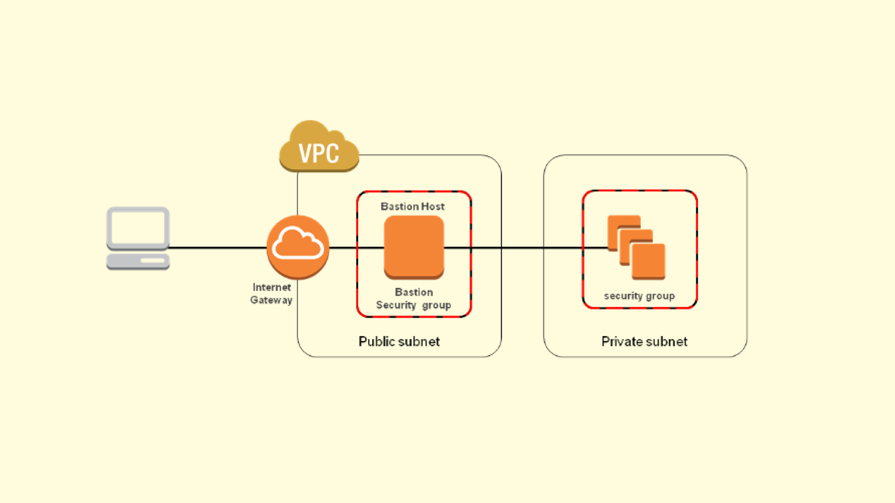

## So what is a bastion host anyways?
It has become the norm these days to have what is called a [bastion](https://en.wikipedia.org/wiki/Bastion_host) host (or perhaps more commonly known as a [Jumpbox](https://en.wikipedia.org/wiki/Jump_server)). This machine generally lives in a public subnet and serves as an SSH gateway into the private subnet/network. See below image. 



## Proxy traffic via the bastion

I've always used the __ProxyCommand__ before to achieve this. A quick example would be adding the following to your `~/.ssh/config` file.  

```ssh-config
Host my-bastion
    HostName bastion.machine.ip
    User bastion-user
    IdentityFile ~/.ssh/bastion.machine.key.pem
    ForwardAgent yes

Host my-private-machine
    HostName private.machine.ip
    User user
    IdentityFile ~/.ssh/private.machine.key.pem
    ProxyCommand ssh user@my-bastion -W %h:%p
```

So what's happening here? 

In our terminal window, when we run the command...
```bash
ssh my-private-machine
```
... we are first connecting to our bastion host, and then connecting to our private machine. This is dictated by the `ProxyCommand` line above. In the background, the SSH protocol is forwarded by `nc`  (netcat) instead of `ssh`. 

This is all well and good, and it worked for me until I discovered `ProxyJump`!

## A cleaner way using ProxyJump

Starting from OpenSSH 7.3, released on August 2016, `ProxyJump` is by far the easiest way to proxy traffic via a bastion host. In fact, it's so useful that it has an entire section dedicated to it in the [docs](https://en.wikibooks.org/wiki/OpenSSH/Cookbook/Proxies_and_Jump_Hosts#Passing_Through_One_or_More_Gateways_Using_ProxyJump).

Here's the basic usage:
```bash
ssh -J my.bastion.host my.private.host
```

That's it. Seriously.

What's cooler, is that in the background, the SSH protocol is now forwarded by `ssh` and not `nc`. And what's even cooler is that you can now do `ProxyJump` chaining. Like this.
```ssh-config
Host my-private-machine
    ProxyJump my-bastion-1, my-bastion-2
``` 

## Bonus: Copying files to your private machine via a bastion host
You can even copy files to a private machine. 
```bash
scp -o 'ProxyJump my.bastion.host' my-file.txt my.private.host:/tmp/my-file.txt
```

That's it for now. 

Peace ✌🏽
